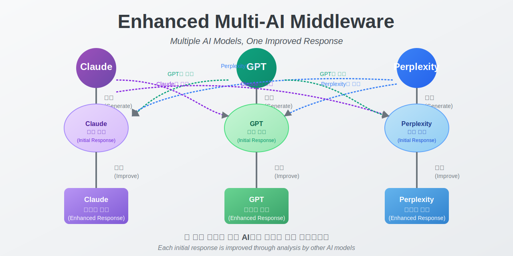
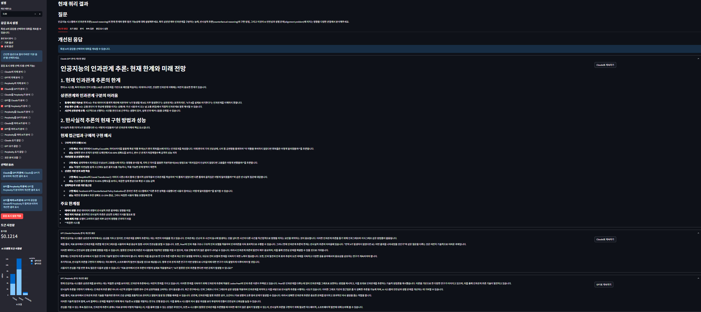
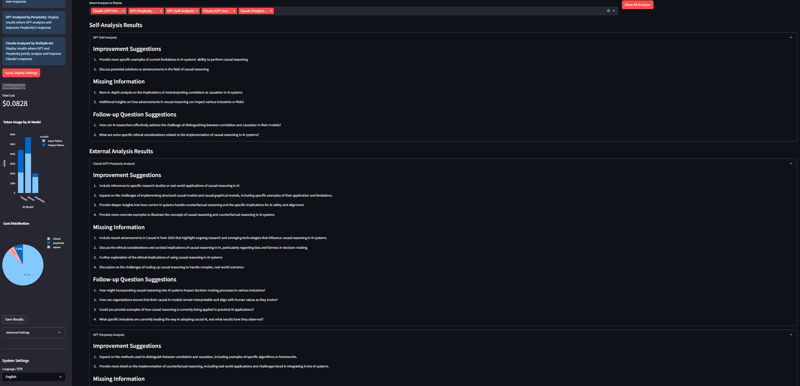

# Enhanced Multi-AI Response System 🤖

> **🚧 Work in Progress** - This project is under active development

A collaborative AI system that leverages multiple models (Claude, GPT, Perplexity) to analyze, compare, and improve responses through cross-model analysis and self-reflection.

<p align="center">
  
</p>

## ✨ Key Features

- **Multi-model Comparison**: Compare responses from Claude, GPT, and Perplexity side-by-side
- **Cross-Analysis**: Each AI model analyzes and improves other models' responses
- **Self-Analysis**: Models analyze and improve their own responses
- **Follow-up Question Extraction**: Automatically identify potential follow-up questions
- **Multilingual Support**: Full English and Korean interface support
- **Streamlit UI**: User-friendly interface for exploring AI model interactions

## 📊 Screenshots

<table>
  <tr>
    <td></td>
    <td></td>
  </tr>
  <tr>
    <td align="center"><b>Comparison View</b></td>
    <td align="center"><b>Analysis View</b></td>
  </tr>
</table>

## 🛠️ Installation

```bash
# Clone the repository
git clone https://github.com/kimh-code/enhanced_multi_ai_response_system.git

# Move to the project directory
cd enhanced_multi_ai_response_system

# Create and activate virtual environment
python -m venv middleware_env
source middleware_env/bin/activate  # Windows: middleware_env\Scripts\activate

# Install dependencies
pip install -r requirements.txt
```

## ⚙️ Configuration

### Option 1: Using config.py
Create a `config.py` file with your API keys:

```python
# API Keys
ANTHROPIC_API_KEY = "your_anthropic_api_key"
OPENAI_API_KEY = "your_openai_api_key"
PERPLEXITY_API_KEY = "your_perplexity_api_key"  # Optional

# Model Settings
ACTIVE_CLAUDE_MODEL = "claude-3-sonnet-20240229"  # Or your preferred Claude model
ACTIVE_GPT_MODEL = "gpt-3.5-turbo"  # Default value, can be changed to "gpt-4", "gpt-4o", etc. as needed
ACTIVE_PERPLEXITY_MODEL = "sonar"  # Or your preferred Perplexity model

# Function to get cost estimates for models
def get_model_cost(model_name):
    """Return prompt and completion costs in USD per 1K tokens"""
    MODEL_COSTS = {
        # Claude models
        "claude-3-opus-20240229": {
            "prompt": 0.015,
            "completion": 0.075
        },
        "claude-3-sonnet-20240229": {
            "prompt": 0.008,
            "completion": 0.024
        },
        "claude-3-haiku-20240307": {
            "prompt": 0.00025,
            "completion": 0.00125
        },
        "claude-3-7-sonnet-20250219": {
            "prompt": 0.008,
            "completion": 0.024
        },
        
        # OpenAI models
        "gpt-4": {
            "prompt": 0.03,
            "completion": 0.06
        },
        "gpt-4-turbo": {
            "prompt": 0.01,
            "completion": 0.03
        },
        "gpt-4o": {
            "prompt": 0.005,
            "completion": 0.015
        },
        "gpt-3.5-turbo": {
            "prompt": 0.0005,
            "completion": 0.0015
        },
        
        # Perplexity models
        "sonar": {
            "prompt": 0.0080,
            "completion": 0.0240
        },
        "pplx-7b-online": {
            "prompt": 0.0006,
            "completion": 0.0012
        },
        "pplx-70b-online": {
            "prompt": 0.0030,
            "completion": 0.0090
        },
        "mistral-7b": {
            "prompt": 0.0006,
            "completion": 0.0012
        },
        "llama-2-70b": {
            "prompt": 0.0030,
            "completion": 0.0090
        }
    }
    
    if model_name in MODEL_COSTS:
        return MODEL_COSTS[model_name]
    else:
        # Default fallback costs
        return {"prompt": 0.008, "completion": 0.024}
```

### Option 2: Using .env file (Recommended for development)
Alternatively, you can use a `.env` file for easier environment management:
```bash
1. Create a `.env` file in the project root directory
2. Add your API keys:
ANTHROPIC_API_KEY=your_anthropic_api_key
OPENAI_API_KEY=your_openai_api_key
PERPLEXITY_API_KEY=your_perplexity_api_key
3. The application will automatically load these variables using python-dotenv
```

## 🚀 Usage

### Streamlit UI
```bash
# Start Streamlit UI
python main.py --ui

# Or directly with streamlit
streamlit run ui/streamlit_app.py
```

### Programmatic Usage
```python
from enhanced_middleware import EnhancedMultiAIMiddleware
import anthropic
import openai

# Initialize clients
claude_client = anthropic.Anthropic(api_key=ANTHROPIC_API_KEY)
openai_client = openai.OpenAI(api_key=OPENAI_API_KEY)

# Initialize middleware
middleware = EnhancedMultiAIMiddleware(claude_client, openai_client)

# Process query
result = middleware.process_query(
    "What is the future of artificial intelligence?",
    show_comparison=True,
    display_improvement_types=["claude_analyzed_by_openai"]
)

# Print improved response
print(result["final_response"])
```

## 📊 User Interface

### Comparison View

*The comparison view shows improved responses from multiple AI models side by side*

### Analysis View

*The analysis view displays detailed model analyses and improvement suggestions*

## 🧠 Response Analysis Types

You can select various analysis and response types:

| Option | Description |
|--------|-------------|
| `claude_analyzed_by_openai` | GPT analyzes and improves Claude's response |
| `openai_analyzed_by_claude` | Claude analyzes and improves GPT's response |
| `claude_analyzed_by_multiple` | Multiple AIs analyze and improve Claude's response |
| `all_self_analysis` | All models analyze their own responses |
| `claude_analyzed_by_self` | Claude analyzes its own response |
| `initial_only` | Display initial responses only (no analysis) |

See the [documentation](docs/RESPONSE_TYPES.md) for more options.

## 🗺️ Roadmap

- [x] Multi-AI model response comparison and improvement
- [x] Streamlit UI implementation
- [x] Multilingual support (Korean/English)
- [ ] Enhanced cross-analysis algorithms
- [ ] Long conversation context management
- [ ] Domain-specific optimization options
- [ ] Support for more LLM providers
- [ ] Performance optimization for token usage

## 🤝 Contributing

Contributions are welcome! Please check out our [Contributing Guidelines](CONTRIBUTING.md).

Areas for improvement:

- Adding support for more AI models
- Improving analysis algorithms
- Enhancing the UI
- Adding more language support
- Optimizing token usage

## ❓ Troubleshooting

If you encounter API connection issues:

- Verify your API keys are correct
- Check your internet connection
- Reinitialize the middleware

If you encounter Claude API overload errors (529), try again after a short delay.

## 📝 License

MIT License - see the [LICENSE](LICENSE) file for details.

## 📞 Contact

For questions, suggestions, or issues, please contact:

- Email: kimh.dev@gmail.com
- GitHub: @kimh-code

---

<p align="center">
<a href="https://github.com/kimh-code/enhanced_multi_ai_response_system/stargazers">⭐ Star us on GitHub</a>
</p>

<p align="center">
<i>README also available in <a href="README_KO.md">한국어</a></i>
</p>