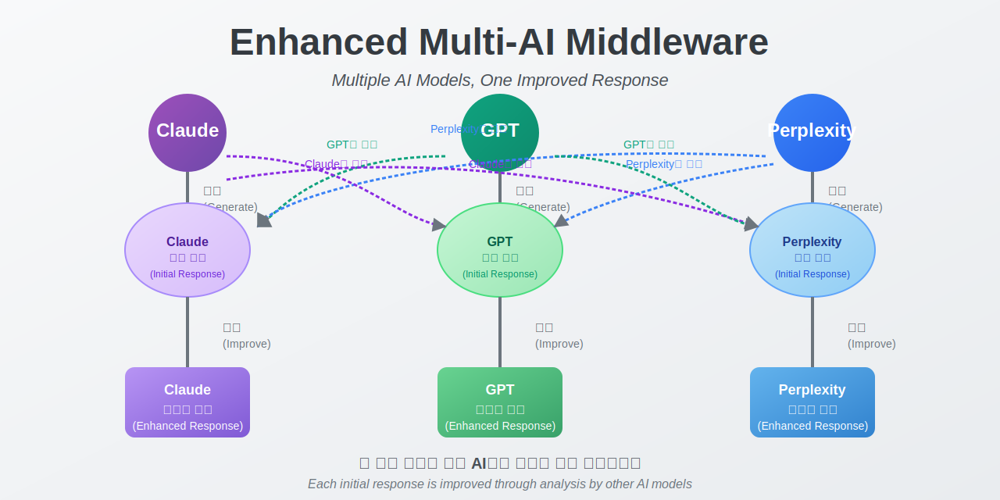

# 개선된 Multi-AI 응답 시스템 🤖

> **🚧 개발 진행 중** - 이 프로젝트는 현재 활발히 개발 중입니다

여러 AI 모델(Claude, GPT, Perplexity)을 활용하여 응답을 분석, 비교하고 교차 모델 분석과 자체 성찰을 통해 개선하는 협력적 AI 시스템입니다.

<p align="center">
  
</p>

## ✨ 주요 기능

- **다중 모델 비교**: Claude, GPT, Perplexity의 응답을 나란히 비교
- **교차 분석**: 각 AI 모델이 다른 모델의 응답을 분석하고 개선
- **자체 분석**: 모델이 자신의 응답을 분석하고 개선
- **후속 질문 추출**: 잠재적 후속 질문 자동 식별
- **다국어 지원**: 영어 및 한국어 인터페이스 완벽 지원
- **Streamlit UI**: AI 모델 상호작용을 탐색하기 위한 사용자 친화적 인터페이스

## 📊 스크린샷

<table>
  <tr>
    <td></td>
    <td></td>
  </tr>
  <tr>
    <td align="center"><b>비교 뷰</b></td>
    <td align="center"><b>분석 뷰</b></td>
  </tr>
</table>

## 🛠️ 설치 방법

```bash
# 저장소 복제
git clone https://github.com/kimh-code/enhanced_multi_ai_response_system.git

# 프로젝트 디렉토리로 이동
cd enhanced_multi_ai_response_system

# 가상환경 생성 및 활성화
python -m venv middleware_env
source middleware_env/bin/activate  # Windows: middleware_env\Scripts\activate

# 종속성 설치
pip install -r requirements.txt
```

## ⚙️ 설정
`config.py` 파일을 생성하고 API 키를 설정하세요:

```python
# API 키
ANTHROPIC_API_KEY = "your_anthropic_api_key"
OPENAI_API_KEY = "your_openai_api_key"
PERPLEXITY_API_KEY = "your_perplexity_api_key"  # 선택 사항

# 모델 설정
ACTIVE_CLAUDE_MODEL = "claude-3-sonnet-20240229"  # 또는 원하는 Claude 모델
ACTIVE_GPT_MODEL = "gpt-3.5-turbo"  # 기본값, 필요에 따라 "gpt-4", "gpt-4o" 등으로 변경 가능
ACTIVE_PERPLEXITY_MODEL = "sonar"  # 또는 원하는 Perplexity 모델

# 모델별 비용 추정치를 가져오는 함수
def get_model_cost(model_name):
    """1K 토큰당 프롬프트 및 완성 비용을 USD로 반환"""
    MODEL_COSTS = {
        # Claude 모델
        "claude-3-opus-20240229": {
            "prompt": 0.015,
            "completion": 0.075
        },
        "claude-3-sonnet-20240229": {
            "prompt": 0.008,
            "completion": 0.024
        },
        "claude-3-haiku-20240307": {
            "prompt": 0.00025,
            "completion": 0.00125
        },
        "claude-3-7-sonnet-20250219": {
            "prompt": 0.008,
            "completion": 0.024
        },
        
        # OpenAI 모델
        "gpt-4": {
            "prompt": 0.03,
            "completion": 0.06
        },
        "gpt-4-turbo": {
            "prompt": 0.01,
            "completion": 0.03
        },
        "gpt-4o": {
            "prompt": 0.005,
            "completion": 0.015
        },
        "gpt-3.5-turbo": {
            "prompt": 0.0005,
            "completion": 0.0015
        },
        
        # Perplexity 모델
        "sonar": {
            "prompt": 0.0080,
            "completion": 0.0240
        },
        "pplx-7b-online": {
            "prompt": 0.0006,
            "completion": 0.0012
        },
        "pplx-70b-online": {
            "prompt": 0.0030,
            "completion": 0.0090
        },
        "mistral-7b": {
            "prompt": 0.0006,
            "completion": 0.0012
        },
        "llama-2-70b": {
            "prompt": 0.0030,
            "completion": 0.0090
        }
    }
    
    if model_name in MODEL_COSTS:
        return MODEL_COSTS[model_name]
    else:
        # 기본 대체 비용
        return {"prompt": 0.008, "completion": 0.024}
```

## 🚀 사용 방법

### Streamlit UI
```bash
# Streamlit UI 시작
python main.py --ui

# 또는 직접 Streamlit으로 실행
streamlit run ui/streamlit_app.py
```

### 프로그래밍 방식 사용법
```python
from enhanced_middleware import EnhancedMultiAIMiddleware
import anthropic
import openai

# 클라이언트 초기화
claude_client = anthropic.Anthropic(api_key=ANTHROPIC_API_KEY)
openai_client = openai.OpenAI(api_key=OPENAI_API_KEY)

# 미들웨어 초기화
middleware = EnhancedMultiAIMiddleware(claude_client, openai_client)

# 쿼리 처리
result = middleware.process_query(
    "인공지능의 미래는 무엇인가요?",
    show_comparison=True,
    display_improvement_types=["claude_analyzed_by_openai"]
)

# 개선된 응답 출력
print(result["final_response"])
```

## 📊 사용자 인터페이스

### 비교 뷰

*비교 뷰는 여러 AI 모델의 개선된 응답을 나란히 보여줍니다*

### 분석 뷰

*분석 뷰는 상세한 모델 분석과 개선 제안을 표시합니다*

## 🧠 응답 분석 유형

다양한 분석 및 응답 유형을 선택할 수 있습니다:

| 옵션 | 설명 |
|-----|-----|
| `claude_analyzed_by_openai` | GPT가 Claude의 응답을 분석하고 개선 |
| `openai_analyzed_by_claude` | Claude가 GPT의 응답을 분석하고 개선 |
| `claude_analyzed_by_multiple` | 여러 AI가 Claude의 응답을 분석하고 개선 |
| `all_self_analysis` | 모든 모델이 자신의 응답을 분석 |
| `claude_analyzed_by_self` | Claude가 자신의 응답을 분석 |
| `initial_only` | 초기 응답만 표시 (분석 없음) |

더 많은 옵션은 [문서](docs/RESPONSE_TYPES.md)를 참조하세요.

## 🗺️ 로드맵

- [x] 다중 AI 모델 응답 비교 및 개선
- [x] Streamlit UI 구현
- [x] 다국어 지원 (한국어/영어)
- [ ] 향상된 교차 분석 알고리즘
- [ ] 장기 대화 컨텍스트 관리
- [ ] 특정 도메인 최적화 옵션
- [ ] 더 많은 LLM 제공자 지원
- [ ] 토큰 사용량 최적화

## 🤝 기여하기

기여는 언제나 환영합니다! [기여 가이드라인](CONTRIBUTING.md)을 확인해 주세요.

개선 가능한 영역:

- 더 많은 AI 모델 지원 추가
- 분석 알고리즘 개선
- UI 향상
- 추가 언어 지원
- 토큰 사용량 최적화

## ❓ 문제 해결

API 연결 문제가 발생하는 경우:

- API 키가 올바른지 확인하세요
- 인터넷 연결을 확인하세요
- 미들웨어를 다시 초기화하세요

Claude API 과부하 오류(529)가 발생할 경우 잠시 후 다시 시도하세요.

## 📝 라이선스

MIT 라이선스 - 자세한 내용은 [LICENSE](LICENSE) 파일을 참조하세요.

## 📞 연락처

질문, 제안 또는 문제가 있으시면 다음으로 연락해 주세요:

- 이메일: kimh.dev@gmail.com
- GitHub: @kimh-code

---

<p align="center">
<a href="https://github.com/kimh-code/enhanced_multi_ai_response_system/stargazers">⭐ GitHub에서 스타 주기</a>
</p>

<p align="center">
<i>README is also available in <a href="README.md">English</a></i>
</p>